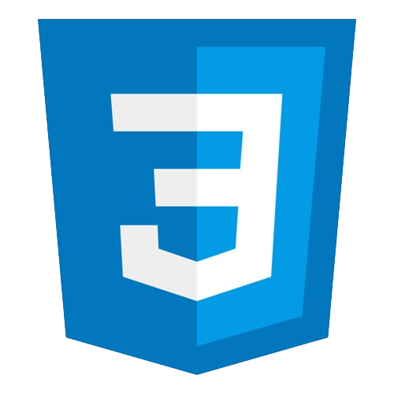
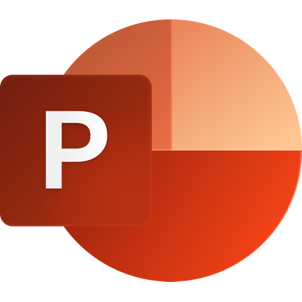

# Hai, Saya Fakhrur Rozi👋

## Tentang Saya:
Saya seorang Fullstack / Developer Web dengan 3+ tahun pengalaman menggunakan PHP untuk membuat, membangun, mengembangkan aplikasi / website.

## Pendidikan:

#### 1. [Universitas Nurul Jadid] (https://www.nuruljadid.net/) | Teknik Informatika | Probolinggo `2014-2018`
#### 2. [MA YTI Nguling] | IPS | Pasuruan `2010-2013`
#### 3. [SMPN 1 Nguling] | Pasuruan `2007-2010`

## Pengalaman Organisasi
September 2016 -  September 2018
 
Departemen Intelektual (HIMATIKA)

## Skill:
1. Frontend
   - HTML / CSS
   - Bootstrap
   - Tailwind CSS
   - Javascript
   - Jquery
   - React JS
   - Next JS
2. Backend
   - PHP
   - CodeIgniter
   - Laravel
   - Node JS
   - Database (MySQL)
   - Application Programming Interface (API)
3. Microsoft Office
   - Word
   - Excel
   - Power Point
4. Troubleshooting & Maintaining
   - PC
   - Laptop
---

### Bahasa Pemrograman:

[][html]
[][css]
[][bootstrap]
[][tailwindcsc]
[][jquery]
[][reactjs]
[][nextjs]
[][codeigniter]
[][Laravel]
[][nodejs]
[][mysql]
[][API]
[][javascript]
[][microsoft]
[][microsoft]
[][microsoft]

 
 

---
### Kontak:

&nbsp;&nbsp;

[html]: https://www.w3schools.com/html
[css]: https://www.w3schools.com/css
[bootstrap]: https://getbootstrap.com
[tailwindcss]: https://tailwindcss.com
[javascript]: https://www.javascript.com
[jquery]: https://jquery.com
[reactjs]: https://react.dev
[nextjs]: https://nextjs.org
[laravel]: https://laravel.com
[codeigniter]: https://codeigniter.com
[nodejs]: https://nodejs.org/en
[mysql]: https://www.mysql.com
[api]: https://aws.amazon.com/id/what-is/api
[microsoft]: https://www.microsoft.com/id-id
